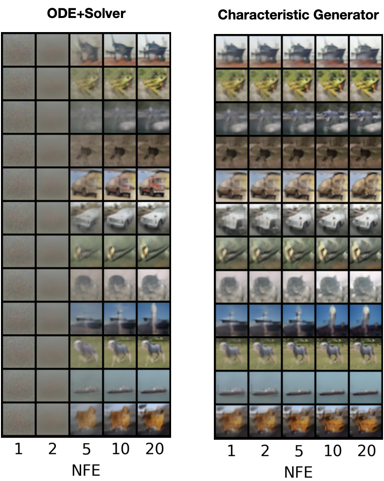

# Characteristic Learning for Provable One Step Generation
This repo contains the implementation for the paper [Characteristic Learning for Provable One Step Generation](https://arxiv.org/abs/ARXIVID)

[](https://arxiv.org/abs/ARXIVID)




## Brief

We propose the characteristic generator, a novel **one-step** generative model that combines the efficiency of sampling in Generative Adversarial Networks (GANs) with the stable performance of flow-based models.

## Preparations

```bash
# install dependent packages
pip install -r requirements
# download LPIPS weights
wget https://github.com/photosynthesis-team/photosynthesis.metrics/releases/download/v0.4.0/lpips_weights.pt
# download inceptionv3 weights
wget https://github.com/mseitzer/pytorch-fid/releases/download/fid_weights/pt_inception-2015-12-05-6726825d.pth
```

- Download `MNIST` and `CIFAR10` dataset into `./data` folder.


## Files

```bash
.
|-- README.md
|-- defaults.py # default model/train/evaluation configs
|-- dist_util.py # for DDP parallelism
|-- eval.py # evaluation, i.e. generating images
|-- fid.py # for computing FID stats
|-- inception.py # InceptionV3 network borrowed from `pytorch-fid`
|-- lpips.py # LPIPS metric borrowed from `pip`
|-- misc.py # auxiliary functions
|-- network.py # backbone U-Net, modified from EDM and CTM
|-- requirements.txt
|-- sde.py # stochastic interpolant under Föllmer setting
|-- stats
|   `-- stats.csv # our FID scores
`-- train.py # denoiser matching and characteristic matching
```

## Denoiser matching

*In practice, to align with existing work, we place target distribution at time 0 and the standard normal distribution at time 1.*

```bash
# modify data_name=['mnist'|'cifar'] and mode='denoiser' in train.py
torchrun --standalone --nnodes 1 --nproc_per_node 4 train.py --workdir "logs/${data_name}-denoiser"
```

## Characteristic matching
```bash
# modify data_name=['mnist'|'cifar'] and mode='characteristic' in train.py
torchrun --standalone --nnodes 1 --nproc_per_node 4 train.py --workdir "logs/$data_name-characteristic" --teacher logs/${data_name}-denoiser/DDPMpp-100000.pth --bsz 64 --global_bsz 256
```

## Image generation
```bash
# modify data_name=['mnist'|'cifar'] in eval.py
 torchrun --standalone --nnodes=1 --nproc_per_node=4 eval.py --mode ${mode}\ # mode=['denoiser'|'characteristic']
                         --checkpoint ${checkpoint} --workdir ${workdir} \
                         --start_seed 0 --end_seed 49999 \
                         --ode_solver ${solver} \ # solver=['euler'|'heun'|'deis']
                         --num_steps $num_step --rho 1 --eval_eps0 1e-3 \
```

## FID calculation
``` bash
# modify data_name=['mnist'|'cifar'] in fid.py
# reference stats
torchrun --standalone --nnodes=1 --nproc_per_node=4 fid.py --data_name ${dataset} --mode=ref --dest stats/${dataset}_ref
# synthetic data stats
torchrun --standalone --nnodes=1 --nproc_per_node=4 fid.py --mode gen --dest stats/${dataset}_synthetic --img_folder ${PATH_TO_GENERATED_IMAGES}
# print FID
python fid.py --mode=fid --ref_path stats/${dataset}_ref.npz --stat_path stats/${dataset}_synthetic.npz 
```

## Checkpoints

Our checkpoints are available at [Google drive](https://drive.google.com/drive/folders/1t2IQwZmEpTaWl-6ySpemmIFArgS9SWCH?usp=sharing).


## References
This repository is built upon some previous works

> CTM for network architecture and characteristic matching https://github.com/sony/ctm

> EDM for network architecture https://github.com/NVlabs/edm

> pytorch-fid for FID calcuation https://github.com/mseitzer/pytorch-fid

> piq for LPIPS metric https://github.com/photosynthesis-team/piq

If you find the code useful for your research, please consider citing

```bib

```
