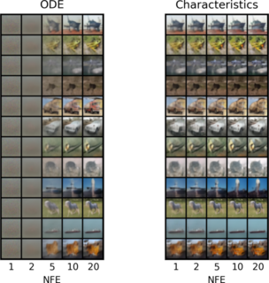

# Characteristic  Learning for One Step Generation
This repo contains the implementation for the paper [Characteristic  Learning for One Step Generation](https://arxiv.org/abs/ARXIVID)

[](https://arxiv.org/abs/ARXIVID)



## Brief

We present a novel characteristic-driven generative learning method, inspired by recent advancements in stochastic interpolation techniques. Given an interpolation-induced unit time probability Ordinary Differential Equation (ODE) flow linking reference and target distributions, we propose a two-parameter flow map, delineating characteristic lines of the ODE, and employ a neural network to nonparametrically estimate it.
Consequently, our method facilitates distribution transformation across any two time points of the ODE flow evolution and finally leads to a one-step generator, hence surpassing existing iterative ODE/SDE-based generative methods in efficiency, offering comparable efficiency to Generative Adversarial Networks (GANs). Our contribution further lies in demonstrating the average convergence of the 2-Wasserstein distance between the distribution associated with the characteristic-driven generator and the exact target distribution, marking a significant exploration in ODE-based generative learning.  

## Preparations

```bash
# install dependent packages
pip install -r requirements
# download LPIPS weights
wget https://github.com/photosynthesis-team/photosynthesis.metrics/releases/download/v0.4.0/lpips_weights.pt
# download inceptionv3 weights
wget https://github.com/mseitzer/pytorch-fid/releases/download/fid_weights/pt_inception-2015-12-05-6726825d.pth
```

- Download `MNIST` and `CIFAR10` dataset into `./data` folder.


## Files

```bash
.
|-- README.md
|-- defaults.py # default model/train/evaluation configs
|-- dist_util.py # for DDP parallelism
|-- eval.py # evaluation, i.e. generating images
|-- fid.py # for computing FID stats
|-- inception.py # InceptionV3 network borrowed from `pytorch-fid`
|-- lpips.py # LPIPS metric borrowed from `pip`
|-- misc.py # auxiliary functions
|-- network.py # backbone U-Net, modified from EDM and CTM
|-- requirements.txt
|-- sde.py # stochastic interpolant under Föllmer setting
|-- stats
|   `-- stats.csv # our FID scores
|-- teaser.py # plot grid view of synthetic images
|-- compare.py # compare images generated by ODE models and characteristic generator
`-- train.py # denoiser matching and characteristic matching
```

## Denoiser matching
```bash
# modify data_name=['mnist'|'cifar'] and mode='denoiser' in train.py
torchrun --standalone --nnodes 1 --nproc_per_node 4 train.py --workdir "logs/${data_name}-denoiser"
```

## Characteristic matching
```bash
# modify data_name=['mnist'|'cifar'] and mode='characteristic' in train.py
torchrun --standalone --nnodes 1 --nproc_per_node 4 train.py --workdir "logs/$data_name-characteristic" --teacher logs/${data_name}-denoiser/DDPMpp-100000.pth --bsz 64 --global_bsz 256
```

## Image generation
```bash
# modify data_name=['mnist'|'cifar'] in eval.py
 torchrun --standalone --nnodes=1 --nproc_per_node=4 eval.py --mode ${mode}\ # mode=['denoiser'|'characteristic']
                         --checkpoint ${checkpoint} --workdir ${workdir} \
                         --start_seed 0 --end_seed 49999 \
                         --ode_solver ${solver} \ # solver=['euler'|'heun'|'deis']
                         --num_steps $num_step --rho 1 --eval_eps0 1e-3 \
                          --churn ${churn} --s_min ${s_min} --s_max ${s_max} --gamma ${gamma} # noise mollification
```

## FID calculation
``` bash
# modify data_name=['mnist'|'cifar'] in fid.py
# reference stats
torchrun --standalone --nnodes=1 --nproc_per_node=4 fid.py --data_name ${dataset} --mode=ref --dest=stats/${dataset}_ref
# synthetic data stats
torchrun --standalone --nnodes=1 --nproc_per_node=4 fid.py --mode gen --dest stats/${desc} --img_folder images/${desc}
# print FID
python fid.py --mode=fid --ref_path stats/${dataset}_ref.npz --stat_path stats/${desc}.npz 
```

## Grid view Teaser
```bash
# modify data_name in teaser.py
python teaser.py --mode characteristic --checkpoint logs/cifar-characteristic/DDPMpp-100000.pth --num_steps 1
```

## Checkpoints

Our checkpoints are available at [Google drive](https://drive.google.com/drive/folders/1t2IQwZmEpTaWl-6ySpemmIFArgS9SWCH?usp=sharing).


## References
This repository is built upon some previous works

> CTM for network architecture and characteristic matching https://github.com/sony/ctm

> EDM for network architecture https://github.com/NVlabs/edm

> pytorch-fid for FID calcuation https://github.com/mseitzer/pytorch-fid

> piq for LPIPS metric https://github.com/photosynthesis-team/piq

If you find the code useful for your research, please consider citing

```bib

```
